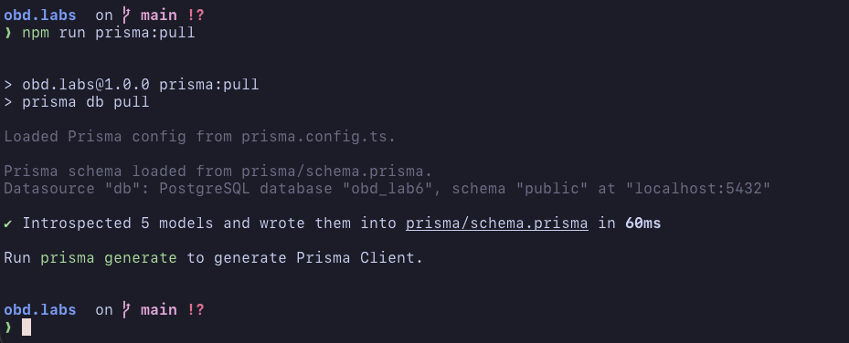
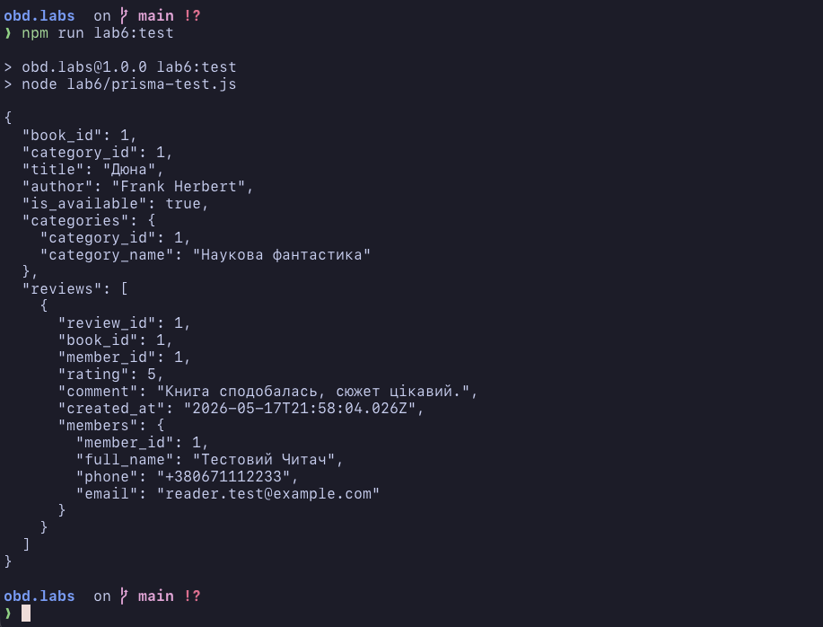
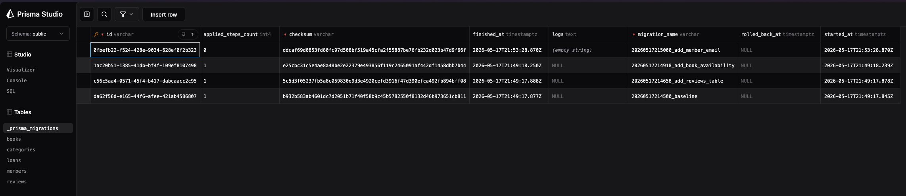

# Звіт з лабораторної роботи №6 (Prisma ORM)
**Виконав:** Брітіков, група ІО-41

## 1. Початкова база даних
У попередніх лабораторних роботах була зроблена база даних бібліотеки.

Початкова схема складалася з таких таблиць:
* `categories`
* `members`
* `books`
* `loans`

За основу була взята схема з попередніх лабораторних робіт, а далі вона була підключена до Prisma.

## 2. Аналіз схеми через Prisma
Для роботи було налаштовано файл `.env` і виконано команду:

```bash
npx prisma db pull
```

Після цього Prisma зчитала структуру бази даних і сформувала файл `prisma/schema.prisma`.

У схемі були отримані моделі:
* `books`
* `categories`
* `members`
* `loans`



## 3. Зміни, які були зроблені

### 3.1 Додавання таблиці `reviews`
Була додана нова таблиця `reviews` для збереження відгуків про книги.

У таблиці є такі поля:
* `review_id`
* `book_id`
* `member_id`
* `rating`
* `comment`
* `created_at`

Також були додані зовнішні ключі на таблиці `books` і `members`.

Міграція:
`prisma/migrations/20260517214658_add_reviews_table/migration.sql`

### 3.2 Додавання поля `is_available` у таблицю `books`
До таблиці `books` було додано поле `is_available`.

Це поле показує, чи доступна книга, і за замовчуванням має значення `true`.

Міграція:
`prisma/migrations/20260517214918_add_book_availability/migration.sql`

### 3.3 Додавання поля `email` у таблицю `members`
До таблиці `members` було додано поле `email`.

Для цього поля було встановлено обмеження `UNIQUE`.

Міграція:
`prisma/migrations/20260517215000_add_member_email/migration.sql`

## 4. Підсумкова структура бази даних
Після виконання змін у базі даних стали такі таблиці:
* `categories`
* `members`
* `books`
* `loans`
* `reviews`

Тобто було:
* додано таблицю `reviews`
* додано поле `is_available` у `books`
* додано поле `email` у `members`

## 5. Перевірка роботи
Для перевірки був використаний файл `lab6/prisma-test.js`.

У ньому:
* створюється тестова категорія
* додається тестовий читач
* додається книга
* додається відгук
* виконується запит з пов'язаними даними

Для запуску використовувалась команда:

```bash
npm run lab6:test
```

У результаті в консолі був отриманий JSON з даними книги, категорії, відгуку і читача.



Також можна подивитися дані через Prisma Studio.



## 6. Висновок
У цій лабораторній роботі було підключено Prisma ORM до вже існуючої бази даних.

Також було зроблено 3 зміни в схемі бази даних через міграції:
* створено таблицю `reviews`
* додано поле `is_available`
* додано поле `email`

Після цього робота була перевірена через Prisma Client.

Отже, Prisma можна використовувати для аналізу схеми бази даних, створення міграцій і перевірки зв'язків між таблицями.
